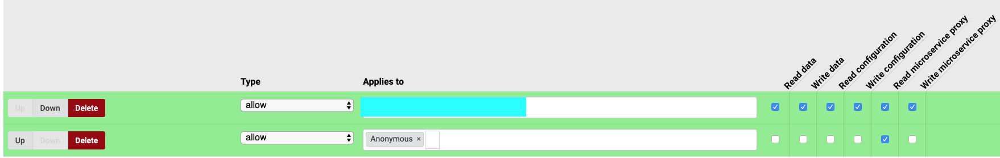
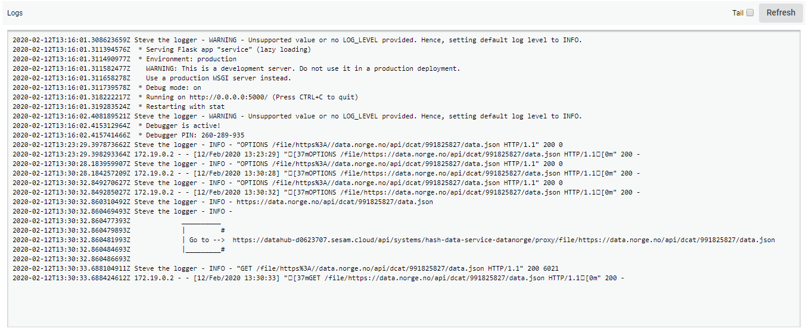
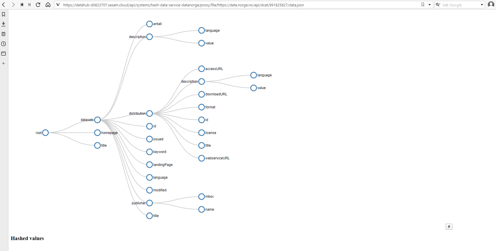

# Hash data service
A connector to look at JSON datasets and choose wich columns to hash.

## Prerequisites
python3

## How to:


*Run program in production*

1. Make sure the required env variables are defined in the system config.

#### System config :

```
  {
    "_id": "hash-data-service",
    "type": "system:microservice",
    "docker": {
      "environment": {
        "base_url": "<node-url>",
        "jwt": "$SECRET(jwt-token)",
        "system_id": "<fill in same same as the _id>"
      },
      "image": "docker-username/docker-container:version-tag",
      "port": 5000
    },
    "verify_ssl": true
  }

```

2. Go into the System permissions tab and under 'local Permissions' add the following :

    


3. Set up input pipe :

#### System config :
```
  {
    "_id": "pipe-id",
    "type": "pipe",
    "source": {
      "type": "json",
      "system": "hash-data-service",
      "url": "/file/<some url to some json file>"
    },
    "pump": {
      "mode": "manual"
    }
  }

```
  Start the pipe, the input should be blank

4. Go back to the system to see proxy address in systemn logger:

  

  Copy the url an paste in web-browser

5. Now choose wich columns you want to hash, then push #:

  

6. Go back to the system, now you should have this key in the environment:


```
"HASHED_VALUES": {
        "hashed_key": ["hashed_key", "parent_of_hashed_key"]
      },

```

7. Finally go back to pipe, now the input should contain input data with hashed values:
